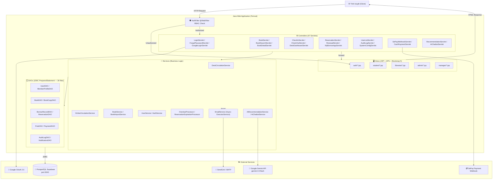
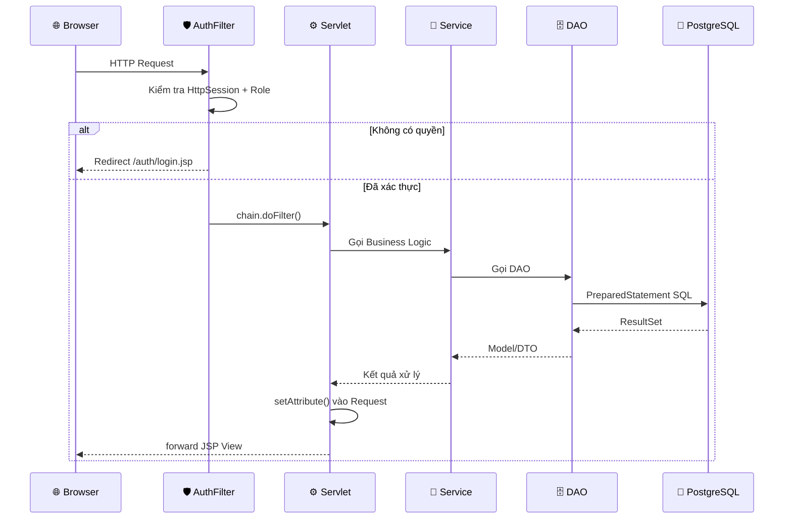
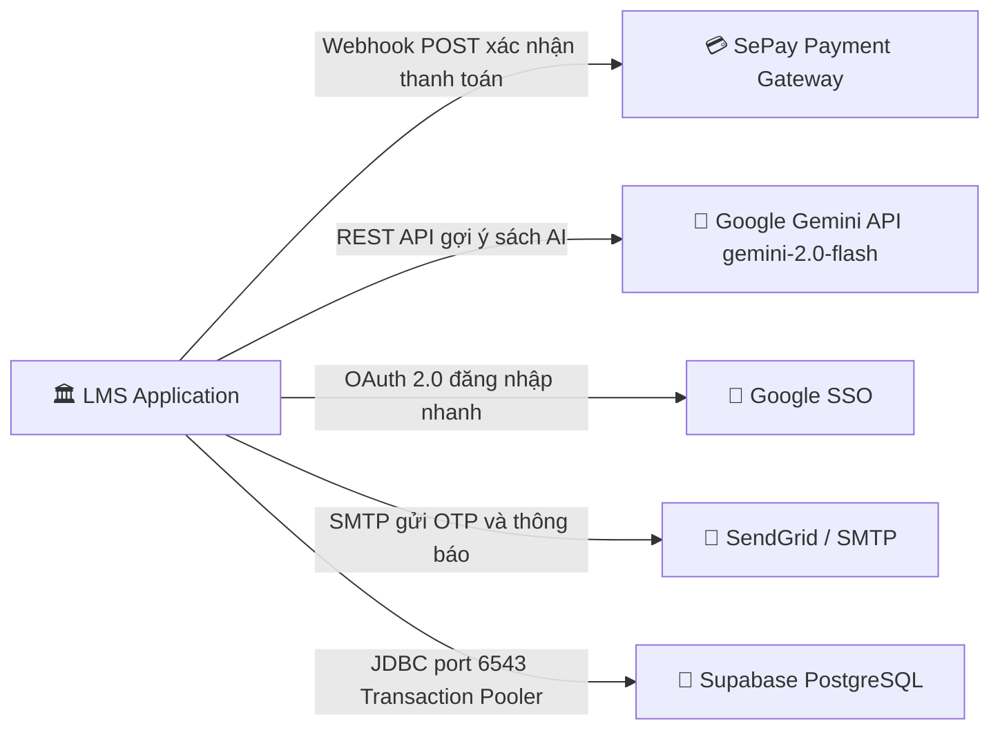

# 📚 LMS — Library Management System

> **Hệ thống Quản lý Thư viện Đại học** | SWP391 — Milestone 2  
> Java Servlet · JDBC · JSP · PostgreSQL (Supabase) · Bootstrap 5

[](https://openjdk.org/projects/jdk/17/)
[](https://jakarta.ee/)
[](https://supabase.com/)
[](https://getbootstrap.com/)

---

## 📋 Mục lục

- [Tổng quan](#-tổng-quan)
- [Kiến trúc hệ thống](#-kiến-trúc-hệ-thống)
- [Các phân hệ người dùng](#-các-phân-hệ-người-dùng)
- [Cơ sở dữ liệu](#-cơ-sở-dữ-liệu)
- [Tích hợp bên ngoài](#-tích-hợp-bên-ngoài)
- [Cấu trúc thư mục](#-cấu-trúc-thư-mục)
- [Controllers & API Routes](#-controllers--api-routes)
- [Bắt đầu nhanh](#-bắt-đầu-nhanh)
- [Bảo mật](#-bảo-mật)
- [Quy ước lập trình](#-quy-ước-lập-trình)
- [Kiểm thử](#-kiểm-thử)
- [Dependencies](#-dependencies)
- [Nhóm phát triển](#-nhóm-phát-triển)

---

## 🔭 Tổng quan

LMS là một **ứng dụng web Java Monolith** phục vụ quản lý thư viện trường đại học. Hệ thống hỗ trợ toàn bộ vòng đời giao dịch thư viện — từ tra cứu sách, đặt trước, mượn/trả, đến tính phạt và thanh toán — với 5 vai trò người dùng được kiểm soát chặt chẽ bằng phân quyền RBAC.

### Tính năng nổi bật

| Tính năng | Mô tả |
|:---|:---|
| 🔐 **Xác thực đa lớp** | Session-based + BCrypt + Brute-force lock + Google SSO + OTP qua email |
| 📖 **Quản lý giao dịch** | Mượn/Trả/Gia hạn/Đặt trước sách với kiểm soát hàng chờ tự động |
| 💳 **Thanh toán** | Tích hợp **SePay** webhook nhận thanh toán phạt trực tuyến |
| 🤖 **AI tích hợp** | Gợi ý sách (Gemini API) + Chatbot thủ thư AI |
| 📧 **Email tự động** | SendGrid/SMTP gửi OTP, thông báo phạt, xác nhận mượn trả |
| 📊 **Báo cáo & Audit** | Audit Log toàn diện cho mọi thao tác C/U/D, xuất Excel/CSV |
| 📦 **Import hàng loạt** | Nhập sách và tài khoản qua file Excel (Apache POI) |
| 🔍 **Kiểm kê kho** | Quét barcode + đối chiếu tồn kho theo vị trí |

---

## 🏗️ Kiến trúc hệ thống

### Sơ đồ MVC Monolith



### Luồng xử lý Request



---

## 👥 Các phân hệ người dùng

| Vai trò | Mô tả | URL Base |
|:---|:---|:---|
| 🎓 **Student** | Tra cứu sách, đặt trước, gia hạn, xem lịch sử mượn, thanh toán phạt | `/student/*` |
| 👩‍🏫 **Lecturer** | Tương tự Sinh viên, hạn mức mượn & thời gian cao hơn | `/lecturer/*` |
| 📚 **Librarian** | Quản lý sách, bản sao, mã barcode, quét mượn/trả tại quầy, kiểm kê kho | `/librarian/*` |
| 🏛️ **Library Manager** | Cấu hình chính sách thư viện, mức phạt, đăng thông báo, xem báo cáo | `/manager/*` |
| 🔧 **SysAdmin** | Quản lý tài khoản, khóa/mở khóa, xem Audit Logs | `/admin/*` |

---

## 🗄️ Cơ sở dữ liệu

**PostgreSQL** host trên **Supabase** (kết nối qua Supavisor Pooler cổng **6543**).

### Sơ đồ quan hệ (ERD rút gọn)

```mermaid
erDiagram
    User {
        int userId PK
        string email
        string passwordHash
        string status
        string role
        int failedLoginAttempts
        timestamp lockedUntil
    }
    MemberProfile {
        int userId PK_FK
        string fullName
        string phoneNumber
        string gender
        date dateOfBirth
    }
    Book {
        int bookId PK
        string isbn
        string title
        string author
        int totalQuantity
        int availableQuantity
        string status
    }
    BookCopy {
        int bookCopyId PK
        int bookId FK
        string barcode
        string location
        string condition
        string status
    }
    BorrowRecord {
        int borrowRecordId PK
        int userId FK
        int bookCopyId FK
        date startDate
        date endDate
        timestamp returnedAt
        string status
        int extensionCount
    }
    Reservation {
        int reservationId PK
        int userId FK
        int bookId FK
        int bookCopyId FK
        string status
        int queuePosition
    }
    Fine {
        int fineId PK
        int borrowRecordId FK
        int userId FK
        decimal amount
        string reason
        string status
    }
    Payment {
        int paymentId PK
        int fineId FK
        decimal paidAmount
        string paymentMethod
        string transactionReference
        string status
    }
    AuditLogs {
        int auditLogId PK
        int userId FK
        string actionType
        string entityName
        string oldValues
        string newValues
        timestamp timestamp
    }

    User ||--o| MemberProfile : "có hồ sơ"
    User ||--o{ BorrowRecord : "mượn"
    User ||--o{ Reservation : "đặt trước"
    User ||--o{ Fine : "bị phạt"
    Book ||--o{ BookCopy : "có bản sao"
    Book ||--o{ Reservation : "được đặt"
    BookCopy ||--o{ BorrowRecord : "được mượn"
    BorrowRecord ||--o| Fine : "phát sinh phạt"
    Fine ||--o| Payment : "được thanh toán"
```

### 28 bảng cốt lõi — phân nhóm

| Nhóm | Bảng |
|:---|:---|
| **Tài khoản** | `"User"`, `MemberProfile`, `Student`, `Lecturer`, `Librarian`, `LibraryManager`, `Admin`, `UserLockReason` |
| **Sách & Danh mục** | `Book`, `BookCopy`, `Category`, `Tag`, `BookCategory`, `BookTag` |
| **Giao dịch** | `BorrowRecord`, `Reservation` |
| **Phạt & Thanh toán** | `Fine`, `Payment` |
| **Cấu hình & Log** | `SystemConfigurations`, `AuditLogs`, `Notification`, `UserNotificationStatus`, `DocumentTemp` |
| **Sự cố & Kiểm kê** | `BookCopyIncident`, `BookImportBatch`, `BookImportError`, `InventorySession`, `InventoryItem` |

> ⚠️ **Lưu ý:** Bảng `User` là từ khóa PostgreSQL — luôn bọc nháy kép: `"User"` trong SQL.

---

## 🔌 Tích hợp bên ngoài



| Dịch vụ | Mục đích | Ghi chú |
|:---|:---|:---|
| **SePay** | Nhận webhook thanh toán phạt tiền | `SePayWebhookServlet` xác thực HMAC |
| **Google Gemini** | Gợi ý sách theo lịch sử mượn, chatbot AI | Model `gemini-2.0-flash` |
| **Google OAuth 2.0** | Đăng nhập bằng tài khoản Google | `GoogleLoginServlet` + `GoogleSSOUtil` |
| **SendGrid / SMTP** | Gửi OTP đặt lại mật khẩu, thông báo phạt | Async qua `ExecutorService` |
| **Supabase/Supavisor** | PostgreSQL cloud DB | Cổng 6543 (IPv4 Pooler) |

---

## 📁 Cấu trúc thư mục

```
LMS-Library_Management_System/
├── src/java/
│   ├── config/
│   │   ├── AiConfig.java              # Cấu hình Gemini API Key
│   │   ├── AppConfig.java             # Hằng số toàn cục
│   │   └── AppContextListener.java    # Khởi tạo scheduler khi deploy
│   ├── controllers/                   # 67 Servlets
│   │   ├── LoginServlet.java
│   │   ├── CheckInServlet.java
│   │   ├── CheckOutServlet.java
│   │   ├── ReservationServlet.java
│   │   ├── SePayWebhookServlet.java
│   │   ├── AiChatbotServlet.java
│   │   └── ... (61 servlet khác)
│   ├── dao/                           # 36 Data Access Objects
│   │   ├── UserDAO.java               # ~45KB
│   │   ├── BorrowRecordDAO.java       # ~41KB
│   │   ├── ReservationDAO.java        # ~51KB
│   │   ├── BookDAO.java               # ~32KB
│   │   └── ...
│   ├── service/                       # 24 Business Logic classes
│   │   ├── DeskCirculationService.java        # ~62KB
│   │   ├── OnlineCirculationService.java      # ~32KB
│   │   ├── AiChatbotService.java              # ~24KB
│   │   ├── OverdueProcessor.java              # Xử lý quá hạn định kỳ
│   │   ├── ReservationExpirationProcessor.java
│   │   └── ...
│   ├── model/                         # Entity Classes
│   ├── dto/                           # Data Transfer Objects
│   ├── filter/
│   │   └── AuthFilter.java            # RBAC WebFilter
│   ├── exception/                     # DatabaseException, ValidationException
│   └── util/                          # DatabaseConnection, CSVHelper, GoogleSSOUtil
│
├── web/
│   ├── auth/                          # Đăng nhập, quên mật khẩu, OTP
│   ├── student/                       # Dashboard, lịch sử mượn
│   ├── lecturer/                      # Dashboard giảng viên
│   ├── librarian/                     # Quản lý sách, kiểm kê, mượn trả
│   ├── manager/                       # Báo cáo, cấu hình, thông báo
│   ├── admin/                         # Quản lý tài khoản, audit log
│   ├── common/                        # Fragments dùng chung
│   └── assets/                        # CSS, JS, images tĩnh
│
├── database/supabase/
│   ├── LMS_Schema_PostgreSQL.sql
│   └── LMS_Seed_Data_PostgreSQL.sql
│
├── test/
│   ├── dao/
│   ├── f6/                            # Desk Circulation Tests
│   └── f8/                            # Book Discovery & AI Tests
│
├── allowedlib/                        # JAR dependencies
├── .sdd/specs/                        # Feature specifications
├── diagram/                           # Activity & Swimlane diagrams
├── DESIGN.md                          # Design System Bootstrap 5
├── AGENTS.md                          # AI Agent rules
└── Dockerfile
```

---

## 🎛️ Controllers & API Routes

### Authentication

| Servlet | URL Pattern | Mô tả |
|:---|:---|:---|
| `LoginServlet` | `/auth/login` | Đăng nhập + Brute-force protection |
| `LogoutServlet` | `/auth/logout` | Hủy session |
| `ForgotPasswordServlet` | `/auth/forgot-password` | OTP qua email |
| `GoogleLoginServlet` | `/auth/google-login` | OAuth 2.0 SSO |

### Giao dịch tại quầy (Librarian)

| Servlet | URL Pattern | Mô tả |
|:---|:---|:---|
| `CheckOutServlet` | `/librarian/desk/checkout` | Mượn sách qua barcode |
| `CheckInServlet` | `/librarian/desk/checkin` | Trả sách + tính phạt |
| `DeskDashboardServlet` | `/librarian/desk` | Dashboard quầy phục vụ |
| `CashPaymentServlet` | `/librarian/desk/payment/cash` | Thu tiền phạt tiền mặt |
| `DeskReservationServlet` | `/librarian/desk/reservation` | Xử lý phiếu đặt trước |

### Giao dịch Online (Student/Lecturer)

| Servlet | URL Pattern | Mô tả |
|:---|:---|:---|
| `ReservationServlet` | `/student/reservation` | Đặt trước sách online |
| `RenewalServlet` | `/student/renewal` | Gia hạn mượn sách |
| `CancelReservationServlet` | `/student/reservation/cancel` | Hủy đặt trước |
| `MyBorrowingsServlet` | `/student/my-borrowings` | Lịch sử mượn cá nhân |
| `MemberFinesServlet` | `/student/fines` | Xem và thanh toán phạt |

### Quản lý sách (Librarian)

| Servlet | URL Pattern | Mô tả |
|:---|:---|:---|
| `BookServlet` | `/librarian/book-management/titles` | CRUD đầu sách |
| `BookCopyServlet` | `/librarian/book-management/copies` | CRUD bản sao + barcode |
| `BookImportServlet` | `/librarian/book-management/import` | Import Excel hàng loạt |
| `BookOverviewServlet` | `/librarian/book-management/overview` | Tổng quan quản lý sách |
| `InventoryReconciliationServlet` | `/librarian/book-management/inventory` | Kiểm kê kho |

### Admin & Hệ thống

| Servlet | URL Pattern | Mô tả |
|:---|:---|:---|
| `UserListServlet` | `/admin/users` | Danh sách tài khoản |
| `AuditLogServlet` | `/admin/audit-logs` | Nhật ký hành động |
| `SePayWebhookServlet` | `/api/payment/webhook/sepay` | Webhook SePay |
| `TriggerOverdueServlet` | `/admin/trigger/overdue` | Kích hoạt xử lý quá hạn |

---

## 🚀 Bắt đầu nhanh

### Yêu cầu môi trường

- **JDK 17+**
- **Apache Tomcat 10.x** (Jakarta EE 10)
- **Apache NetBeans 17+**
- **PostgreSQL** (hoặc Supabase account)

### Cài đặt & Chạy

**1. Clone repository**
```bash
git clone https://github.com/thanhtuanfptse05/LMS-Library_Management_System.git
cd LMS-Library_Management_System
```

**2. Cấu hình Database**

```sql
-- Chạy trên Supabase SQL Editor hoặc psql
\i database/supabase/LMS_Schema_PostgreSQL.sql
\i database/supabase/LMS_Seed_Data_PostgreSQL.sql
```

**3. Cấu hình kết nối JDBC** trong `src/java/util/DatabaseConnection.java`:
```java
private static final String URL =
    "jdbc:postgresql://db.xxxx.supabase.co:6543/postgres?sslmode=require";
private static final String USER = "postgres.xxxx";
private static final String PASSWORD = "your-password";
```

> ⚠️ Sử dụng **cổng 6543** (Supavisor Pooler) để tránh lỗi IPv6 `UnknownHostException`.

**4. Cấu hình AI** trong `src/java/config/AiConfig.java`:
```java
public static final String GEMINI_API_KEY = "your-gemini-api-key";
```

**5. Build & Deploy** (NetBeans):
```
Right-click project → Clean and Build → Run
```

**6. Truy cập**
```
http://localhost:8080/LMS-Library_Management_System/
```

---

## 🔐 Bảo mật

| Cơ chế | Triển khai |
|:---|:---|
| **Mã hóa mật khẩu** | BCrypt (`jbcrypt-0.4.jar`) |
| **Phân quyền RBAC** | `AuthFilter.java` bảo vệ `/admin/*`, `/librarian/*`, `/manager/*`, `/student/*` |
| **Chống SQL Injection** | 100% `PreparedStatement` |
| **Brute-force protection** | Khóa tài khoản theo `failedLoginAttempts` + `lockedUntil` |
| **Session management** | `HttpSession` invalidation khi logout |

---

## 📐 Quy ước lập trình

| Loại file | Quy tắc | Ví dụ |
|:---|:---|:---|
| Controllers | `PascalCase + Servlet` | `LoginServlet.java` |
| Models | `PascalCase` | `BorrowRecord.java` |
| DAOs | `PascalCase + DAO` | `BookDAO.java` |
| Views (JSP) | `kebab-case` | `book-list.jsp` |
| DB Tables | `PascalCase` | `BorrowRecord`, `"User"` |
| DB Columns | `camelCase` | `userId`, `startDate` |

**UI Rules:**
- 🇻🇳 **100% tiếng Việt** — mọi nhãn, thông báo, lỗi
- **Bootstrap 5.x** — không dùng Tailwind CSS
- Màu chủ đạo: `#d97706` (Terracotta Orange) · Font: `Inter`

**Git Workflow:**
```
Branch: Nhánh cá nhân (Bao, Tuan, Thai, Quyet, Chuong)
Commit: [Who][type]: [scope] - [description]

Ví dụ: Bao[feat](borrow): implement checkout flow with barcode scan
```

---

## 🧪 Kiểm thử

```
test/
├── dao/
│   ├── BookDAOTest.java
│   ├── BookCopyDAOTest.java
│   └── ...
├── f6/                            # Desk Circulation
│   ├── DeskCirculationServiceUnitTest.java
│   ├── DeskCirculationServiceIntegrationTest.java
│   └── DeskCirculationServiceParameterTest.java
└── f8/                            # Book Discovery & AI
    ├── step1_dao/
    ├── step2_service/
    ├── step3_controller/
    └── step4_view/
```

---

## 📦 Dependencies

| Thư viện | Phiên bản | Mục đích |
|:---|:---|:---|
| `postgresql` | 42.7.3 | JDBC Driver |
| `jbcrypt` | 0.4 | Mã hóa BCrypt |
| `jakarta.servlet.jsp.jstl` | 2.0.0 | JSTL tag library |
| `poi` + `poi-ooxml` | 5.2.5 | Đọc/ghi Excel |
| `jakarta.mail` | 2.0.1 | Gửi email |
| `log4j-api` + `log4j-core` | 2.21.1 | Logging |
| `commons-io` | 2.15.0 | File I/O utilities |
| `junit` | 4.13.2 | Unit testing |

---

## 🐳 Docker

```bash
docker build -t lms-app .
docker run -p 8080:8080 lms-app
```

---

## 👨‍💻 Nhóm phát triển

| Thành viên | Nhánh | Phụ trách |
|:---|:---|:---|
| **Bao** | `Bao` | Authentication, Security |
| **Tuan** | `Tuan` | Book Management, AI Features |
| **Thai** | `Thai` | Desk Circulation, Payment |
| **Quyet** | `Quyet` | Online Circulation, Reservation |
| **Chuong** | `Chuong` | Admin, Reports, Notifications |

---

## 📄 Tài liệu bổ sung

- [DESIGN.md](DESIGN.md) — Design System & UI Guidelines
- [AGENTS.md](AGENTS.md) — AI Agent Development Rules
- [.sdd/specs/](.sdd/specs/) — Feature Specifications
- [database/supabase/](database/supabase/) — SQL Schema & Seed Data
- [diagram/](diagram/) — Activity & Swimlane Diagrams

---

<div align="center">

**LMS — Library Management System**  
*SWP391 | FPT University | Milestone 2*

Made with ❤️ by Team LMS

</div>
