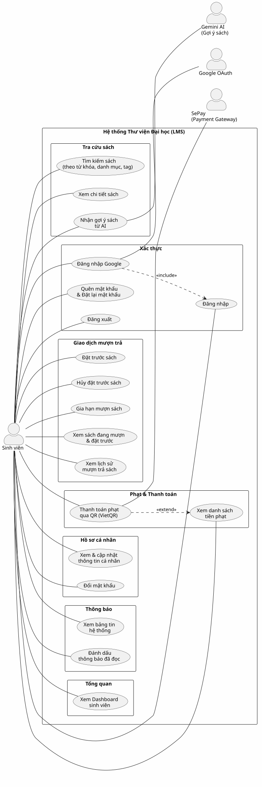

# Use Case Index — Student (Trích xuất từ mã nguồn)

> **Feature:** `student-code-actual`
> **Actor chính:** Sinh viên (Student)
> **Ngày tạo:** 2026-07-26
> **Nguồn dữ liệu:** Phân tích mã nguồn thực tế (Servlet Controllers + AuthFilter + DAO/Service)

---

## Diagram

---

## Actors

| Actor | Loại | Mô tả | Nguồn (Code Evidence) |
|-------|------|--------|----------------------|
| Sinh viên (Student) | Primary | Người dùng chính — sinh viên đại học sử dụng hệ thống thư viện | `AuthFilter.java:187` role=STUDENT, `StudentDashboardServlet.java`, `StudentProfileServlet.java` |
| Google OAuth | System (External) | Dịch vụ đăng nhập bên thứ 3 qua Google | `GoogleLoginServlet.java:17` URL `/login-google` |
| SePay (Payment Gateway) | System (External) | Cổng thanh toán trực tuyến qua VietQR | `MemberFinesServlet.java:84` SePay config, `SePayWebhookServlet.java`, `PaymentApiServlet.java` |
| Gemini AI (Gợi ý sách) | System (External) | Dịch vụ AI gợi ý sách cá nhân hóa | `RecommendationServlet.java:37` `AiRecommendationService`, `AiConfig.java` |

---

## Use Cases

| ID | Tên Use Case | Package | Route (URL Pattern) | Servlet Controller | Ghi chú |
|----|-------------|---------|---------------------|-------------------|---------|
| UC01 | Đăng nhập | Xác thực | `/login` | `LoginServlet` | Session-based auth, BCrypt |
| UC02 | Đăng nhập Google | Xác thực | `/login-google` | `GoogleLoginServlet` | OAuth 2.0, include UC01 logic |
| UC03 | Quên mật khẩu & Đặt lại mật khẩu | Xác thực | `/forgot-password` | `ForgotPasswordServlet` | OTP qua email (async) |
| UC04 | Đăng xuất | Xác thực | `/logout` | `LogoutServlet` | Invalidate session |
| UC05 | Tìm kiếm sách | Tra cứu sách | `/book-search` | `BookSearchServlet` | Keyword + Category + Tag + filter status |
| UC06 | Xem chi tiết sách | Tra cứu sách | `/book-detail` | `BookDetailServlet` | Yêu cầu login (redirect guest) |
| UC07 | Nhận gợi ý sách từ AI | Tra cứu sách | `/recommendation` | `RecommendationServlet` | Cần ≥3 lượt mượn, fallback top trending |
| UC08 | Đặt trước sách | Giao dịch mượn trả | `/student/reserve` | `ReservationServlet` | Gọi `OnlineCirculationService.reserveBook()` |
| UC09 | Hủy đặt trước sách | Giao dịch mượn trả | `/student/cancel-reservation` | `CancelReservationServlet` | Gọi `OnlineCirculationService.cancelReservation()` |
| UC10 | Gia hạn mượn sách | Giao dịch mượn trả | `/student/renew` | `RenewalServlet` | Gọi `OnlineCirculationService.renewBook()` |
| UC11 | Xem sách đang mượn & đặt trước | Giao dịch mượn trả | `/student/my-borrowings` | `MyBorrowingsServlet` | Active borrows + active reservations |
| UC12 | Xem lịch sử mượn trả sách | Giao dịch mượn trả | `/student/borrow-history` | `BorrowHistoryServlet` | Toàn bộ lịch sử (all statuses) |
| UC13 | Xem danh sách tiền phạt | Phạt & Thanh toán | `/student/fines` | `MemberFinesServlet` | Paid + unpaid fines, auto-create Payment pending |
| UC14 | Thanh toán phạt qua QR (VietQR) | Phạt & Thanh toán | `/api/payment-status` | `PaymentApiServlet` | AJAX polling, SePay webhook xác nhận |
| UC15 | Xem & cập nhật thông tin cá nhân | Hồ sơ cá nhân | `/student/profile` | `StudentProfileServlet` | GET: view, POST action=updateInfo |
| UC16 | Đổi mật khẩu | Hồ sơ cá nhân | `/student/profile` | `StudentProfileServlet` | POST action=changePw, invalidate session |
| UC17 | Xem bảng tin hệ thống | Thông báo | `/notifications` | `NewsServlet` | Phân trang, lọc keyword + type |
| UC18 | Đánh dấu thông báo đã đọc | Thông báo | `/notification/mark-read` | `NotificationStatusServlet` | AJAX POST, markOne / markAll |
| UC19 | Xem Dashboard sinh viên | Tổng quan | `/student/dashboard` | `StudentDashboardServlet` | 4 KPI + active loans + recent + trending |

---

## Relationships

| Loại | Từ (From) | Đến (To) | Rationale |
|------|-----------|----------|-----------|
| `<<include>>` | UC02 (Đăng nhập Google) | UC01 (Đăng nhập) | `GoogleLoginServlet` gọi chung `AuthService.login()` và tạo HttpSession giống `LoginServlet` — logic xác thực session luôn bắt buộc. |
| `<<extend>>` | UC14 (Thanh toán phạt QR) | UC13 (Xem danh sách phạt) | `MemberFinesServlet` tự tạo Payment pending cho Fine unpaid — nút QR chỉ xuất hiện khi có khoản unpaid (điều kiện). Xem phạt vẫn hoạt động đủ nghĩa nếu không có khoản nào cần thanh toán. |

---

## Phương pháp trích xuất

Toàn bộ Use Cases được trích xuất **100% từ mã nguồn thực tế**, không dựa vào tài liệu spec:

1. **AuthFilter.java** (L182-191): Xác định URL pattern `/student/*` chỉ cho phép role `STUDENT`.
2. **@WebServlet annotations**: Quét tất cả Servlet trong `src/java/controllers/` để tìm URL patterns có prefix `/student/` hoặc public routes.
3. **Phân tích logic Servlet**: Đọc `doGet()`/`doPost()` để hiểu chức năng thực tế (DAO calls, Service calls, forward JSP).
4. **External system detection**: Phát hiện actor ngoài từ Service/Config imports (`GoogleSSOUtil`, `AiRecommendationService`, `SystemConfigDAO` cho SePay).
