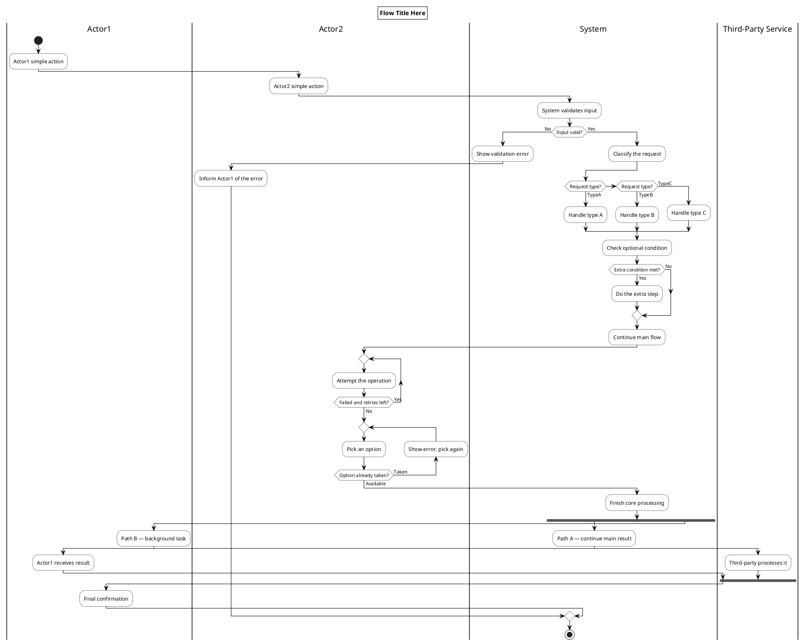
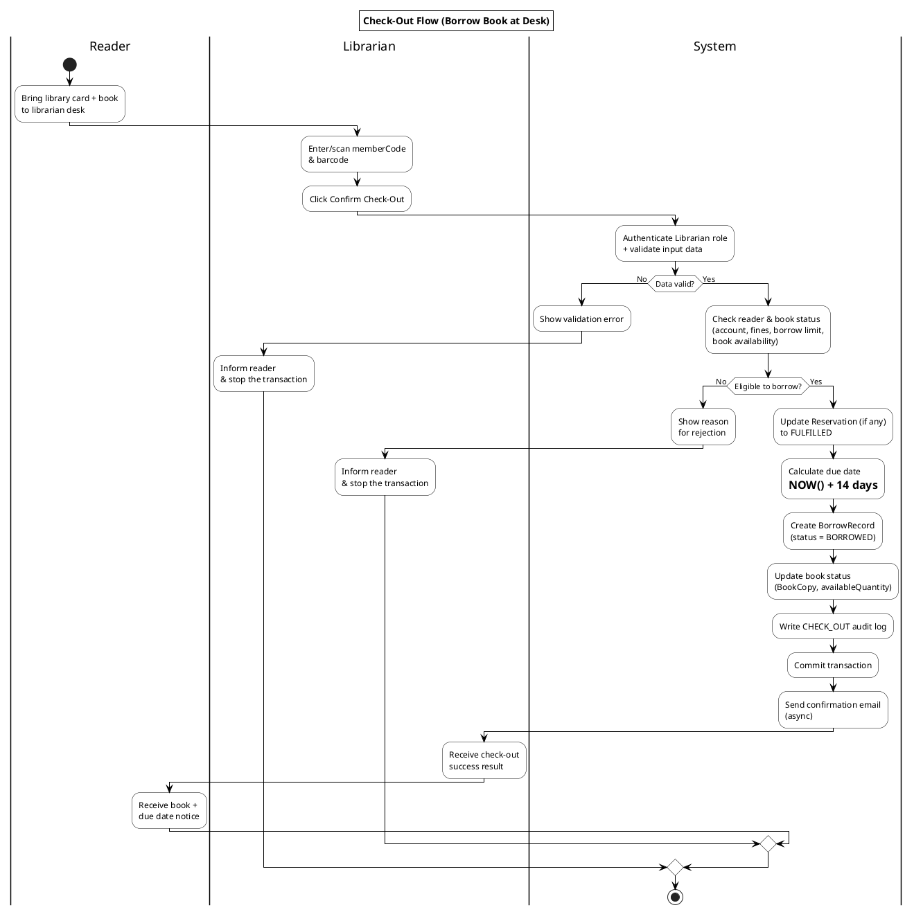

# PlantUML Activity Diagram — Ruleset & Template

## 1. Quy tắc trừu tượng hoá luồng

1. **Gộp theo câu hỏi nghiệp vụ, không theo điều kiện code**: nhiều `if` cùng dẫn tới 1 hành động kế tiếp → gộp thành 1 quyết định duy nhất. Chỉ tách khi mỗi điều kiện dẫn tới hành động khác nhau.
2. **Tên node = hành động nghiệp vụ, không phải tên hàm/class**. Sai: `Call UserLookupDAO.findById()` → Đúng: `Look up reader account`.
3. **Mỗi lane = 1 actor chịu trách nhiệm, không phải 1 layer kỹ thuật**. Controller/Filter/Service/DAO → gộp chung 1 làn `System`. Chỉ tách làn riêng cho actor thực khác (người khác, hệ thống bên thứ 3).
4. **Ẩn lỗi kỹ thuật tự động** (rollback, transaction, exception) — không ai ra quyết định ở đó nên không hiện trên diagram.
5. **Giảm tối đa số lần nhảy lane qua lại**. Gộp các bước xử lý con liên tiếp của cùng 1 actor thành 1 mạch, chỉ nhảy lane khi cần actor khác hành động — tránh kiểu "ping-pong" gây rối (hiện tượng "mì Ý").

**Test nhanh:** "Nếu xoá bước này, người đọc còn hiểu đúng luồng nghiệp vụ không?" — còn hiểu thì bỏ.

**Trade-off:** diagram tối ưu để truyền đạt luồng sẽ mất chi tiết cần cho derive test case. Không dùng chung 1 diagram cho cả 2 mục đích nếu cần độ chính xác cao ở cả hai.

## 2. Quy tắc trình bày PlantUML

- Ngôn ngữ: **tiếng Anh** cho toàn bộ node/label.
- Nền trắng, viền đen cho activity và decision (`skinparam` — xem template).
- Quyết định luôn dùng `if/then/else` để PlantUML tự vẽ hình thoi.
- **Chỉ đúng 2 nút đen: 1 `start`, 1 `stop`** — mọi nhánh phải hội tụ về `stop` chung.
- **Nhánh lỗi/thất bại: ưu tiên nối thẳng (không loop-back), nhưng vẫn phải hội tụ về đúng 1 `stop` chung** — dùng **nested if/else** (nhánh lỗi ở "No" chỉ có vài bước rồi dừng viết tiếp, nhánh "Yes" chứa toàn bộ phần còn lại của luồng lồng bên trong), để cả nhánh lỗi và nhánh thành công đều tự nhiên chảy xuống cùng 1 `stop` ở cuối file — không gọi `stop` riêng ở từng nhánh (sẽ tạo nhiều nút đen, sai quy tắc). Loop-back chỉ dùng khi nghiệp vụ thực sự cần quay lại thử ngay tại chỗ, và phải quay về đúng bước trước bước kiểm tra vừa fail.
- **Khai báo lại `|System|` (hoặc lane chính) ngay trước mỗi `else`/`endif`** trong nested if/else: giúp diamond hợp lưu (merge point) mà PlantUML tự sinh ra ở mỗi `endif` bớt lệch cột hơn, vì cả 2 nhánh đều "trở về" cùng 1 lane trước khi đóng if. Đây chỉ là cải thiện thẩm mỹ nhẹ (giới hạn layout tự động của PlantUML), không sửa được lệch hoàn toàn khi 2 nhánh chênh lệch nhiều node.
- Title có viền (dùng khi cần đóng khung tên Pool/luồng cho rõ, giống ảnh mẫu có khung): thêm `skinparam titleBorderThickness 1`, `skinparam titleBorderColor Black`, `skinparam titleBackgroundColor White` trước dòng `title`.

## 3. Template copy-dùng (đầy đủ mọi case)

## 4. Ví dụ áp dụng — Check-Out Flow

