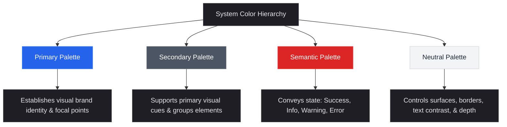

# Global UI/UX Design Constitution

## 1. Purpose

This document serves as the absolute, single source of truth for all User Interface (UI) and User Experience (UX) decisions. It establishes a technology-agnostic, project-independent framework of universal design standards. Every future specification, design system, wireframe, user flow, individual page, component interface, and frontend implementation must strictly adhere to the principles, guidelines, and metrics defined herein to ensure functional excellence, absolute visual consistency, and a premium, unified user experience.

---

## 2. Core Design Principles

### 2.1 Simplicity
* **Rule:** Eliminate unnecessary cognitive load by minimizing interface complexity. Keep the user focused on their primary objective.
* **Practice:** Every visual element on a screen must serve a clear operational or informational purpose. If an element does not assist the user in completing a task or understanding content, it must be removed.
* **Complexity Control:** Group advanced settings or secondary actions and hide them behind progressive disclosure mechanisms (e.g., collapsible panels, tabs, or advanced search menus).

### 2.2 Consistency
* **Rule:** Maintain absolute uniformity across all visual elements, behavioral responses, terminology, and interaction flows.
* **Practice:** Utilize strict, predefined design tokens for colors, typography, spacing, and sizing. Similar actions must always produce identical outcomes, regardless of context or user location in the application.
* **Patterns:** Standardize common operations (e.g., table pagination, filter resets, modal confirmations, and destructive actions) to build strong, repeatable user mental models.

### 2.3 Clarity
* **Rule:** Ensure the interface is immediately understandable. A user must instantly comprehend where they are, what information is presented, and how to execute their next action.
* **Practice:** Use clear, concise text alongside distinct visual cues. Interactive elements must present clear affordances that signal their interactive nature (e.g., buttons must look clickable; text inputs must look writable).
* **Hierarchy:** Place critical information in the primary optical path and secondary details in supportive positions.

### 2.4 Accessibility
* **Rule:** Ensure interfaces are fully usable by all individuals, including those with physical, sensory, cognitive, or situational impairments.
* **Practice:** Treat accessibility as a primary architectural requirement rather than a secondary checklist. All applications must strictly comply with Web Content Accessibility Guidelines (WCAG) 2.1/2.2 AA standards.
* **Implementation:** Design with semantic elements, reliable keyboard focus indicators, screen reader compatibility, and robust color contrast ratios.

### 2.5 Scalability
* **Rule:** Design systems and layouts to seamlessly adapt to fluctuating quantities of data, varying screen dimensions, and future feature expansions without breaking.
* **Practice:** Avoid hardcoded layouts. Always utilize flexible structures (e.g., CSS Grid, Flexbox, or auto-layout equivalents) that adapt dynamically to varying content volumes, localized text lengths, and differing viewport dimensions.

### 2.6 Maintainability
* **Rule:** Construct layouts and components to facilitate straightforward visual and behavioral updates over time.
* **Practice:** Implement modular, highly reusable component architectures. Define a centralized, token-based variables system for color palettes, spacing units, and typography styles, ensuring global updates can be made at a single point of origin.

### 2.7 Predictability
* **Rule:** Align interface behaviors with established universal standards to minimize the user learning curve.
* **Practice:** Keep interactive components functioning in line with common industry standards (e.g., clicking a logo returns the user to the home screen; clicking outside a modal dismisses it; the "Escape" key closes active overlays). Avoid non-standard interactions unless they provide a significant, proven efficiency gain.

### 2.8 User-Centered Design
* **Rule:** Every design decision must prioritize the actual goals, workflows, and physical environment of the end user.
* **Practice:** Design workflows to minimize physical movement and cognitive effort. Prioritize layout configurations based on actual user frequency of use, placing high-frequency tasks in the most easily accessible locations.

---

## 3. Design System Standards

### 3.1 Color System



#### 3.1.1 Color Hierarchy & Application
To maintain clear visual priority, color distribution must strictly follow the **60-30-10 Rule**:
* **60% Dominant (Neutrals):** Backgrounds, structural containers, and body text.
* **30% Secondary (Structural & Supporting):** Card backgrounds, borders, active navigation states, and inactive inputs.
* **10% Accent (Primary / Interactive):** Call-to-action buttons, key progress highlights, interactive links, and critical status changes.

#### 3.1.2 Primary Color Palette
* **Purpose:** Drives focus to the primary actions, interactive elements, and essential highlights on a page.
* **Standard:** Limit the primary range to a cohesive family of shades. The core brand accent must offer excellent visibility on both light and dark backgrounds. It must be reserved strictly for actionable visual elements.

#### 3.1.3 Secondary Color Palette
* **Purpose:** Complements the primary color, group related sections, and handles secondary actions.
* **Standard:** Select secondary tones that provide clear visual contrast against the primary palette. They must never compete with primary call-to-actions for visual attention.

#### 3.1.4 Semantic Color Palette
Semantic colors communicate functional status and systemic feedback. They must be applied uniformly across the entire ecosystem:
* **Error:** Communicates failures, validation blocks, or high-risk actions. Must use standard shades of red.
* **Warning:** Signals system warnings, impending limits, or actions requiring caution. Must use standard shades of yellow/orange.
* **Success:** Indicates successful task completion, system readiness, or safe states. Must use standard shades of green.
* **Information:** Indicates helpful hints, updates, or neutral status notifications. Must use standard shades of blue/teal.

#### 3.1.5 Neutral Palette
* **Purpose:** Handles body copy, borders, backgrounds, container surfaces, and subtle visual dividers.
* **Standard:** Incorporate a comprehensive neutral scale (typically 10 steps from absolute light to absolute dark). Warm or cool gray undertones must be kept consistent to maintain overall visual harmony.

#### 3.1.6 Color Contrast Requirements
* **Text Contrast:** Body copy and headings must maintain a minimum contrast ratio of `4.5:1` against their background (WCAG AA). For large text (18pt / 24px and larger, or bold text at 14pt / 18.67px and larger), the minimum contrast ratio is `3:1`.
* **Non-Text Elements:** Icons, form input borders, button states, and active selection highlights must maintain a minimum contrast ratio of `3:1` against adjacent colors.
* **Color Dependency Rule:** Do not rely on color alone to convey meaning or state changes. Integrate text labels, distinct iconography, or clear pattern variations alongside color cues to ensure clarity for colorblind or visually impaired users.

---

### 3.2 Typography

#### 3.2.1 Typography Scale
To establish an immediate, natural reading hierarchy, typography scales must follow a strict mathematical progression (such as the Major Third scale, multiplier `1.25` or Minor Third scale, multiplier `1.2`):

| Level | Size (px) | Line Height | Font Weight | Primary Usage |
| :--- | :--- | :--- | :--- | :--- |
| **Display** | 40px – 48px | 1.15 – 1.2 | Bold / Extra Bold | Hero banners, high-impact landing layouts |
| **Heading 1 (H1)** | 32px – 36px | 1.2 – 1.25 | Bold | Primary page header (exactly one per view) |
| **Heading 2 (H2)** | 24px – 28px | 1.25 – 1.3 | Semi-Bold / Bold | Core layout sections, major content blocks |
| **Heading 3 (H3)** | 20px – 22px | 1.3 – 1.35 | Semi-Bold | Inner section titles, modal headers, card titles |
| **Body (Default)** | 14px – 16px | 1.5 – 1.6 | Regular | Body text, list elements, form inputs |
| **Body (Small)** | 12px – 13px | 1.4 – 1.5 | Regular / Medium | Helper text, input labels, table captions |
| **Caption** | 10px – 11px | 1.3 – 1.4 | Medium / Semi-Bold | Badges, status pills, micro-metadata |

#### 3.2.2 Readability & Composition
* **Line Length Limit:** To prevent eye strain, body copy containers must maintain a line length between **45 and 75 characters per line** (including spaces). This is typically equivalent to a container width limit of `600px` to `700px`.
* **Font Family Limits:** Restrict applications to a maximum of two font families: one highly legible Sans-Serif font for user interface controls and body copy, and a secondary font (optional) for display titles or editorial headings.
* **Letter Spacing:** Apply micro-adjustments to letter spacing to maximize readability: slightly expand spacing for uppercase text and captions (e.g., `+0.05em`), and slightly condense it for massive display headings (e.g., `-0.02em`).

---

### 3.3 Spacing System

To ensure mathematical visual alignment, all layout, sizing, and spacing metrics must adhere to an **8-pixel Grid System** (with optional 4-pixel steps for fine-grained components):

$$\text{Spacing Increment} = n \times 8\text{px} \quad (n \in \{0.5, 1, 2, 3, 4, 6, 8, 12\})$$

#### 3.3.1 Spacing Token Registry

| Token Name | Value | Logical Application |
| :--- | :--- | :--- |
| `space-xxs` | 4px | Icon offsets, input inner borders, badge padding |
| `space-xs` | 8px | Label-to-input gap, inline element spacing, small list items |
| `space-sm` | 16px | Standard button padding, internal card padding, grid item gaps |
| `space-md` | 24px | Standard card padding, modal inner gutters, list item blocks |
| `space-lg` | 32px | Section-to-section gaps, page-level outer margins |
| `space-xl` | 48px | Outer layout margins for large views, header blocks |
| `space-xxl` | 64px | Editorial layout spacing, high-impact hero structures |

#### 3.3.2 Layout & Component Spacing Standards
* **Grid Alignment:** Align all structural containers, cards, tables, and sidebars to the global 8px grid. Use consistent margins and padding to build reliable visual corridors.
* **White-Space Usage:** Negative space is a vital structural tool, not empty screen real estate. Use generous spacing between complex information blocks to reduce cognitive load and allow layouts to breathe. Do not cram components together to save vertical space.

---

## 4. Layout Standards

```
+-----------------------------------------------------------------------+
|  LOGO  |  Search...         |  Nav 1  Nav 2  Nav 3  |  User Profile   | <-- Primary Header
+-----------------------------------------------------------------------+
|  Sidebar Navigation  |  H1: Primary Page Title                        |
|  - Dashboard         |  ------------------------------                |
|  - Management        |  +-----------+  +-----------+  +------------+  |
|  - Settings          |  |  Card 1   |  |  Card 2   |  |   Card 3   |  | <-- 3-Column Grid
|  - Activity          |  +-----------+  +-----------+  +------------+  |
|                      |                                                |
|                      |  +------------------------------------------+  |
|                      |  |              Data Table                  |  | <-- High Density Data
|                      |  +------------------------------------------+  |
+-----------------------------------------------------------------------+
```

### 4.1 Page Structure
* **Layout Layout Hierarchy:** Build pages using semantic HTML5 elements: `<header>`, `<nav>`, `<main>`, `<section>`, `<aside>`, and `<footer>`.
* **Structural Safety Margins:** Define standard outer gutters for pages. Viewports must retain a minimum margin of `16px` on mobile, `24px` on tablet, and `32px` on desktop layouts.
* **Scroll Behavior:** Ensure the main viewport scrolls vertically. Never allow secondary, nested scrolling areas to conflict with main page navigation. Avoid horizontal scrolling layouts unless displaying linear tabular data.

### 4.2 Navigation Hierarchy
* **Primary Navigation:** Locate primary navigation links in highly visible, predictable areas: a persistent top navigation bar or a sticky left-hand sidebar.
* **Contextual Navigation (Breadcrumbs):** Integrate breadcrumbs for hierarchical structures deeper than three levels, giving users a simple click path back to parent pages.
* **Active State Indication:** Highlight active navigation links using high-contrast indicators, such as color shifts, weight changes, or subtle accent borders.

### 4.3 Content Hierarchy & Reading Paths
* **Reading Flow Alignment:** Arrange content to match natural reading habits: use a Z-pattern for visual landing structures and an F-pattern for text-heavy, database-driven administrative displays.
* **The "Above-the-Fold" Rule:** Ensure the primary page header, structural status signals, and critical primary action buttons are visible within the default viewport height without requiring scrolling.

### 4.4 Information Density Standards
* **Optimal Visual Balance:** Balance white space and information density to match the audience and task context:
  * **Low-Density Views (Public/Landing Pages):** Maximize line spacing, use generous padding, and keep visuals sparse to optimize comprehension.
  * **High-Density Views (Data Entry/Management Dashboards):** Use compact layouts with tighter row heights (`36px` to `40px` for table rows) to allow comparison of dense data sets with minimal scrolling.

---

## 5. Component Standards

Every UI component must follow these functional rules to ensure consistent behavior across all parts of the application.

### 5.1 Buttons
* **Purpose:** Triggers immediate system actions, form submissions, or critical workflow changes.
* **Consistency Rules:** Establish clear visual hierarchies for button states:

```
+--------------------+      +--------------------+      +--------------------+
|      PRIMARY       |      |     SECONDARY      |      |      TERTIARY      |
|  Solid Primary BG  |      |   Outlined/Light   |      |    Text Borderless |
|  White Text        |      |   Contrast Text    |      |    Accent Text     |
+--------------------+      +--------------------+      +--------------------+
  High Visual Weight          Medium Visual Weight         Low Visual Weight
```

* **Interaction Rules:** Make sure interactive elements have clear visual transitions for `:hover`, `:focus`, `:active`, and `:disabled` states. The button dimensions must change predictably to match these states without shifting surrounding elements.
* **Accessibility Requirements:** Provide a minimum tap target size of **44 x 44 pixels** for all buttons. Use clear ARIA roles (e.g., `role="button"`) when using custom markup, and allow activation via the `Space` and `Enter` keys.

### 5.2 Inputs
* **Purpose:** Allows users to input and edit alphanumeric data.
* **Consistency Rules:** Keep input sizes consistent across the application. Borders must clearly define the input boundaries and change color to reflect state changes (e.g., active focus, validation errors).
* **Interaction Rules:** Transition placeholder text to an inactive state once input begins. Implement a visual cursor focus ring (min `2px` width) that provides high contrast against the input background.
* **Accessibility Requirements:** Keep form input fields explicitly bound to screen-readable `<label>` tags using the `for` attribute. Ensure any descriptive helper or validation error text is programmatically linked to the input via `aria-describedby`.

### 5.3 Forms
* **Purpose:** Groups related inputs to collect structured datasets.
* **Consistency Rules:** Align labels above inputs for optimal visual scanning. Arrange input groups logically in single-column paths, using multi-column configurations only for highly related values (e.g., City, State, ZIP).
* **Interaction Rules:** Validate fields on blur or input changes, avoiding validation triggers before the user has interacted with a field.
* **Accessibility Requirements:** Support native tab navigation. Keyboard focus must move logically from top-to-bottom and left-to-right through input fields.

### 5.4 Cards
* **Purpose:** Groups related information, attributes, and actions into a single visual container.
* **Consistency Rules:** Apply identical shadow elevations, border-radii, and padding structures to all cards across the system.
* **Interaction Rules:** When an entire card is interactive, apply subtle rise elevations and shadow changes on `:hover` to signal interactivity. Avoid using nested interactive targets within a fully clickable card.
* **Accessibility Requirements:** When a card is clickable, ensure the main header inside the card serves as the keyboard focus point, with its descriptive content read as assistive text.

### 5.5 Tables
* **Purpose:** Presents tabular, multi-column datasets for simple comparison and review.
* **Consistency Rules:** Use persistent table headers that remain visible during vertical scrolling. Right-align numeric columns, left-align text columns, and center status indicators.
* **Interaction Rules:** Highlight table rows clearly on hover. Limit inline actions within rows to clear, compact icon buttons or a single, standardized action menu.
* **Accessibility Requirements:** Structure tables using semantic markup (`<table>`, `<thead>`, `<tbody>`, `<th>`, `<tr>`, `<td>`). Headers (`<th>`) must include `scope="col"` or `scope="row"` tags to guide screen readers through complex data rows.

### 5.6 Modals
* **Purpose:** Displays high-priority tasks, critical alerts, or details without navigating away from the current page context.
* **Consistency Rules:** Use consistent maximum widths (`small: 400px`, `medium: 600px`, `large: 800px`) and center modals within the viewport overlay.
* **Interaction Rules:** Trap keyboard focus inside the modal. Clicking the background overlay or pressing the "Escape" key must dismiss the modal, unless the modal contains unsaved changes.
* **Accessibility Requirements:** Set `role="dialog"` and `aria-modal="true"`. Programmatically link the title of the modal using `aria-labelledby` to ensure immediate context when read by screen readers.

### 5.7 Menus (Drop-downs)
* **Purpose:** Exposes a list of contextual options, navigation paths, or filters.
* **Consistency Rules:** Position drop-down containers directly below their trigger elements. Match drop-down borders and border-radii to the input standards.
* **Interaction Rules:** Close active menu systems instantly when a user clicks outside the menu container, hits the "Escape" key, or makes a selection.
* **Accessibility Requirements:** Implement full keyboard navigation support (`Up` / `Down` arrows to navigate options, `Enter` / `Space` to select, and `Escape` to close). Set `aria-haspopup="true"` and `aria-expanded` attributes to track activation.

### 5.8 Alerts & Feedback Components
* **Purpose:** Delivers real-time information regarding system states, errors, successes, or warnings.
* **Consistency Rules:** Color-code alerts using the semantic palette (e.g., success = green, error = red). Place alerts in predictable layouts (e.g., persistent banners at the top of a page, or temporary toast notifications in a screen corner).
* **Interaction Rules:** Ensure alert messages are clear and contain actionable next steps where applicable. Toasts must remain visible long enough to be read (typically 4-6 seconds) and include a manual close button.
* **Accessibility Requirements:** Set `role="alert"` (for high-priority errors) or `role="status"` (for minor status changes) to trigger screen readers to announce updates immediately.

---

## 6. Form Design Standards

```
  Email Address *
  [ user@example.com           ]  <-- Focused Input Field
  (i) Helper: Enter your primary account email.
  
  Password *
  [ **********                 ]  <-- Errored Input Field (Red Border)
  [x] Error: Password must contain at least 8 characters.
```

### 6.1 Validation Behavior
* **Triggering Rules:** Validate input fields on `blur` or when the user changes focus. Do not validate fields while the user is actively typing, as this creates a frustrating and visually noisy experience.
* **Optimistic Validation:** Instantly confirm valid inputs with subtle visual indicators once a field satisfies all validation rules.

### 6.2 Error Handling
* **Error Text Rules:** Place validation messages directly below the corresponding input field. Write error text in clear, plain language that explains both what went wrong and how to fix it (e.g., write *"Password must be at least 8 characters"* instead of *"Invalid Input"*).
* **Visual Integrity:** Use red borders to highlight error fields, and include a clear warning icon alongside the error message. Do not rely on red text alone to signal errors.

### 6.3 Required Field Indication
* **Standard Visual Indicator:** Mark required fields with a clear visual indicator, such as a colored asterisk (`*`) immediately following the field label. Include a legend explaining the indicator at the top of the form layout.
* **Legend Rule:** Avoid using the visual indicator if *all* fields in a form are required. Instead, place a single, clear note at the top of the form (e.g., *"All fields in this form are required"*).

### 6.4 User Guidance
* **Helper Text Placement:** Position persistent helper text directly below the form input field. Use helper text to clarify formatting expectations, structural rules, or privacy terms.
* **Input Masks:** Utilize dynamic input masks for structured inputs (e.g., dates, phone numbers, or currencies) to guide formatting in real-time, preventing input validation issues before they occur.

### 6.5 Submission Patterns
* **State Control Rules:** Disable form submission buttons immediately upon click to prevent accidental double-submissions. Show a clear loading spinner or status indicator within the button label during submission.
* **Non-Destructive Processing:** Ensure form validation errors do not clear existing, valid user input. Let users correct errors without re-entering the entire form dataset.

---

## 7. Data Presentation Standards

### 7.1 Tables
* **Interactive Elements:** Integrate sortable headers with distinct indicators (e.g., up/down arrows) that clearly show active sorting states. Keep column widths dynamic, preventing text wrapping from making rows unreadable.
* **Row Formatting:** Avoid using alternating zebra stripes unless tables exceed 5 columns or contain highly dense, complex numeric rows. Instead, use thin, light border lines to separate rows.

### 7.2 Lists
* **Content Structure:** Keep visual styles consistent across list items. Ensure items of the same type feature identical icon sizes, text margins, and action placements.
* **Action Bars:** Reveal hover actions consistently on list items to keep layouts clean, while ensuring fallback actions remain visible on touch-screen viewports.

### 7.3 Dashboards
* **Visual Grouping:** Organize dashboard widgets into clear, logical sections. Separate blocks using cards or container borders, maintaining consistent gaps between widgets.
* **Key Metric Highlights:** Display critical key performance indicators (KPIs) in large, high-contrast layouts at the top of dashboards, providing an instant summary of system health.

### 7.4 Statistics
* **Numeric Displays:** Render key statistics in high-impact styles (typically 32px to 48px sizes). Include a small, high-contrast label above or below the metric to explain its meaning.
* **Trend Indicators:** Display positive or negative trend metrics using standard semantic colors (e.g., green for positive growth, red for negative trends), and include a clear icon indicator (e.g., up/down arrow).

### 7.5 Empty States
* **Zero-State Guidelines:** An empty state must never be left blank. Every empty state container must feature:
  * A simple, low-contrast illustration or descriptive icon.
  * A clear title stating that no data is currently available.
  * A brief text explanation explaining *why* the container is empty.
  * A primary call-to-action button to guide the user's next step (e.g., *"Create New Item"*).

### 7.6 Loading States
* **Skeleton Screen Rules:** Use skeleton screens that mimic the actual page layout instead of full-screen loading spinners. This reduces the perceived loading time and provides visual structure.
* **Local Spinners:** When loading small components or processing background actions, restrict spinners to the affected area to avoid disrupting the rest of the user interface.

---

## 8. Accessibility Standards

Absolute compliance with **WCAG 2.1/2.2 Level AA** is a mandatory technical requirement for all interfaces.

### 8.1 Keyboard Navigation
* **Global Accessibility Flow:** Users must be able to navigate every page, active workflow, and custom component using only a keyboard.
* **Tab Order Logical Paths:** Ensure focus shifts logically through interactive components, matching the visual reading path (top-to-bottom, left-to-right).
* **Modal Escapes:** Ensure overlays, menus, and modals can be closed instantly by pressing the `Escape` key, returning the user focus to the original triggering element.

### 8.2 Focus Management
* **Focus Indicators:** Ensure focused elements display a highly visible focus outline (minimum width `2px`, offset `2px`). Never hide default browser focus outlines without replacing them with custom, high-contrast focus rings.
* **No Keyboard Traps:** Keyboard focus must never get trapped within an interface element. Users must always be able to navigate forward and backward using standard keyboard shortcuts (e.g., `Tab` and `Shift + Tab`).

### 8.3 Screen Reader Support
* **ARIA Standard Compliance:** Use semantic HTML tags (`<button>`, `<main>`, `<nav>`, `<input>`) before resorting to custom ARIA attributes. Apply clear `aria-label` or `aria-labelledby` properties when text headings are absent.
* **Image Descriptions:** Ensure all non-decorative images feature descriptive `alt` tags. Mark decorative images with empty `alt=""` attributes so screen readers ignore them.

### 8.4 Color Contrast Standards
* **Calculated Contrast Metrics:** Maintain a strict contrast ratio of `4.5:1` for regular text, and `3:1` for large text and key graphic elements against their background colors.
* **Dual-Coding Systems:** Never communicate system state changes or highlight critical inputs using color alone. Combine color shifts with descriptive text labels, icons, or patterns.

### 8.5 Error Communication
* **Error Text Accessibility:** Programmatically link error messages to their corresponding inputs using `aria-describedby`, ensuring screen readers announce validation failures as they occur.
* **Target Shifts:** On form submission failures, automatically shift focus to the first invalid field on the page, allowing screen reader users to quickly correct errors.

---

## 9. Responsive Design Standards

```
         MOBILE (<600px)                 TABLET (600px - 1024px)              DESKTOP (>1024px)
      +-------------------+             +-----------------------+          +---------------------------+
      |  [=]   LOGO   [U] |             |  LOGO  | Search... [U] |          |  LOGO  Nav 1  Nav 2   [U] |
      +-------------------+             +-----------------------+          +---------------------------+
      | H1: Page Title    |             | H1: Page Title        |          | H1: Page Title            |
      | +---------------+ |             | +---------+ +-------+ |          | +-----+ +-----+ +-----+   |
      | | Card 1 (Full) | |             | | Card 1  | |Card 2 | |          | |Card1| |Card2| |Card3|   |
      | +---------------+ |             | +---------+ +-------+ |          | +-----+ +-----+ +-----+   |
      | +---------------+ |             |                       |          |                           |
      | | Card 2 (Full) | |             |                       |          |                           |
      | +---------------+ |             |                       |          |                           |
      +-------------------+             +-----------------------+          +---------------------------+
         Single Column                     Multi-Column Reflow                  Full Grid Layout
```

### 9.1 Mobile Viewports (<600px)
* **Visual Optimizations:** Arrange layout grids into a single vertical column. Stack forms, fields, and buttons vertically to fit smaller displays.
* **Tap Targets:** Provide a minimum tap target size of **48 x 48 pixels** for all buttons and interactive elements, with at least `8px` of spacing between targets to prevent accidental taps.
* **Interface Controls:** Hide complex desktop navigation menus behind a standardized, simple mobile navigation menu (e.g., a hamburger menu).

### 9.2 Tablet Viewports (600px - 1024px)
* **Reflow Strategies:** Shift layouts to two-column grid configurations, wrapping content naturally to prevent horizontal scrolling.
* **Navigation Adaptations:** Collapse persistent sidebar menus into compact icon bars, or place navigation items into a responsive top navigation bar.

### 9.3 Desktop Viewports (1024px - 1440px)
* **Layout Structures:** Enable full multi-column dashboard layouts, displaying persistent sidebars alongside dense data displays.
* **Readability Constraints:** Restrict body content areas to a maximum width of `1200px` to maintain comfortable text line lengths.

### 9.4 Large Screen Viewports (>1440px)
* **Layout Safety Constraints:** Cap the maximum layout width at `1440px` and center the page container within the viewport, using background margins to absorb remaining screen real estate.
* **Grid Alignments:** Maintain consistent column grid alignments, avoiding arbitrary element stretching that creates excessive white space.

---

## 10. Dark Mode Standards

### 10.1 Background Architecture
* **Pure Dark Prevention:** Avoid using pure black (`#000000`) for primary dark mode backgrounds, as it causes high visual contrast and eye strain. Instead, use dark charcoal, deep slate, or navy hues.
* **Layering & Elevation:** Create depth using lighter surface shades to represent higher visual layers (e.g., page background = `#121212`, card background = `#1e1e1e`, modal background = `#2a2a2a`).

### 10.2 Color System Adaptations
* **Visual Adjustments:** Desaturate primary, secondary, and semantic color palettes to maintain a comfortable reading contrast against dark backgrounds without causing visual vibration.
* **Visual Contrast Levels:** Ensure all text and interactive borders meet WCAG AA contrast standards (`4.5:1` for body copy) on dark backgrounds.

### 10.3 Graphical Elements
* **Vector Controls:** Reduce the opacity of bright illustrations in dark mode (typically to `80%`) to prevent visual harshness.
* **Borders & Shadows:** Replace dark shadows with subtle, light borders (e.g., `1px` border using a semi-transparent white) to separate overlapping components.

---

## 11. UX Interaction Standards

### 11.1 Feedback Mechanisms
* **Action Verifications:** Provide instant, visible feedback for every user action. Button clicks must display distinct pressed states, and long-running actions must show inline progress.
* **Micro-interactions:** Use subtle transitions (e.g., 150ms-250ms ease-in-out transitions) on hover and focus states to make the interface feel responsive and alive. Avoid distracting, over-the-top animations.

### 11.2 Loading Behaviors
* **Perceived Speed Optimization:** Use progress indicators for actions taking longer than 1.0 second. For actions taking under 1.0 second, display immediate optimistic state changes.
* **Loading Placement:** Keep loading indicators localized to the active component to avoid blocking the user from interacting with the rest of the application.

### 11.3 Error States
* **Graceful Recoveries:** Design error experiences to be helpful rather than frustrating. Clearly explain the issue and provide direct links or steps to help the user resolve the problem.
* **Session Protections:** Prevent data loss during errors. Keep form data intact if a submission fails, allowing the user to make corrections without starting over.

### 11.4 Success States
* **Action Confirmations:** Confirm successful actions with clear, simple status indicators. Provide clear next steps or navigation options so the user knows what to do next.

### 11.5 Confirmation Flows
* **Contextual Modals:** Require explicit user confirmation for actions that are difficult to undo (e.g., closing a form with unsaved changes). Use inline popovers or modals depending on the severity of the action.

### 11.6 Destructive Actions
* **Two-Step Confirmations:** Require a clear, two-step confirmation flow for permanent, high-risk actions (e.g., deleting data). Color-code destructive actions in red, and require users to click a second confirmation button to execute.

```
  +--------------------------------------------+
  |              Confirm Deletion              |
  +--------------------------------------------+
  |  This action is permanent and cannot be    |
  |  undone. Please confirm to proceed.        |
  |                                            |
  |  [ Cancel (Focus) ]     [ Delete Account ] | <-- Red Destructive Button
  +--------------------------------------------+
```

---

## 12. Design Quality Gates

Before any UI implementation, component, or view is marked complete and merged into production, it must satisfy all parameters in this quality checklist:

### 12.1 Consistency Gate
* [ ] The design strictly uses predefined global tokens for colors, typography, borders, and spacing.
* [ ] All custom component behaviors (e.g., dropdowns, modals) align with standard patterns.
* [ ] UI icons and terminology match existing global system patterns.

### 12.2 Accessibility Gate
* [ ] The entire view can be navigated and operated using only a keyboard.
* [ ] Text and key non-text elements satisfy WCAG AA contrast standards.
* [ ] All form inputs are bound to descriptive labels, and icons feature alternative text.

### 12.3 Responsiveness Gate
* [ ] The view functions correctly and maintains visual integrity across all standard viewports.
* [ ] Tap targets on mobile screens are at least 48 x 48 pixels with proper spacing.
* [ ] Content wraps naturally without causing horizontal scrolling on small screens.

### 12.4 Maintainability Gate
* [ ] The implementation uses modular, reusable components without duplicate styles.
* [ ] Stylings avoid arbitrary visual overrides and inherit from the global design system.
* [ ] HTML markup uses semantic elements rather than generic nested layout containers.

### 12.5 Reusability Gate
* [ ] Component designs prioritize flexibility, using props/parameters rather than hardcoded content.
* [ ] Elements use layout containers that scale dynamically to fit different amounts of text.

### 12.6 User Clarity Gate
* [ ] The page layout features a single, clear primary goal and a distinct visual hierarchy.
* [ ] Interactive components provide immediate visual feedback for hover, focus, and click states.
* [ ] Error and success states are clearly communicated using both color and descriptive text/icons.

---

## 13. Enforcement Rules

### 13.1 Global Applicability
* Every future software specification, user flow design, user interface wireframe, and frontend implementation must strictly comply with this document.
* Automated checks (e.g., code linters, accessibility test suites) must run during continuous integration to ensure codebase compliance with these rules.

### 13.2 Exceptions & Conflict Resolution
* Any conflict between a specific project requirement and this constitution must be explicitly documented and approved by the UX Lead.
* Exceptions are only granted if they are backed by documented user research or unique platform-specific constraints.
